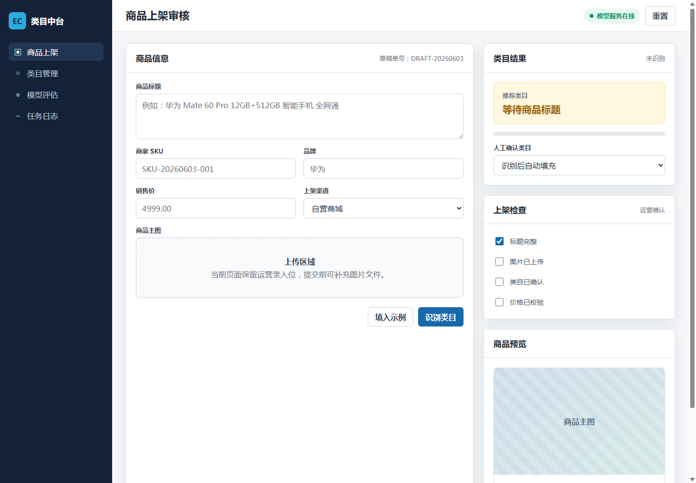

# ProductClassification

面向电商运营场景的商品标题智能分类系统。项目使用中文 BERT 微调模型，根据商品标题自动推荐商品类目，可嵌入商品上架、类目审核、运营录入和基础质检流程。

## 项目概述

电商运营在创建商品时，通常需要根据商品标题、品牌和商品信息选择对应类目。人工选择类目容易受到经验、类目体系复杂度和批量上架压力影响。本项目通过文本分类模型对商品标题进行自动识别，给出推荐类目，帮助运营人员减少重复判断，提高上架效率和类目一致性。

当前项目包含完整的训练、评估、预测和 Web 服务流程：

- 基于 `google-bert/bert-base-chinese` 的商品标题多分类模型。
- 支持 TSV 原始数据预处理和 Hugging Face Datasets 数据集保存。
- 支持模型训练、验证集评估、测试集评估和命令行预测。
- 提供 FastAPI 推理接口。
- 提供面向电商运营的商品上架类目识别工作台。

## 运行效果



## 技术栈

- Python 3.10+
- PyTorch
- Transformers
- Datasets
- scikit-learn
- FastAPI
- Uvicorn
- HTML / CSS / JavaScript

## 项目结构

```text
ProductClassification/
  src/
    main.py                  # 命令行入口
    configuration/config.py  # 项目路径、模型路径和训练参数
    preprocess/              # 数据预处理和数据加载
    runner/                  # 训练、评估和预测逻辑
    web/                     # FastAPI 服务和前端页面
  data/
    raw/                     # 原始 TSV 数据
  checkpoint/
    label.txt                # 类别标签
    best/config.json         # 微调模型配置
    best/vocab.txt           # 本地 tokenizer 词表
  docs/
    product-workbench.png    # 页面运行截图
```

## 数据格式

原始数据使用 TSV 格式，包含两列：

```text
label	text_a
家居	樱之歌蓝色之恋5件套日式釉下彩纯手绘家用餐具套装陶瓷器碗盘碗碟微波炉可用
```

数据文件：

- `data/raw/train.txt`
- `data/raw/valid.txt`
- `data/raw/test.txt`

当前类别体系包含 30 个商品类目，类别清单保存在 `checkpoint/label.txt`。

## 环境安装

推荐使用 Conda 创建独立环境：

```powershell
conda create -n product-classify python=3.12
conda activate product-classify
pip install -r requirements.txt
```

项目默认使用 Hugging Face 镜像：

```text
HF_ENDPOINT=https://hf-mirror.com
```

如果你的网络可以直接访问 Hugging Face，可以在启动前覆盖或移除该环境变量。

## 运行方式

预处理数据：

```powershell
python src/main.py preprocess
```

训练模型：

```powershell
python src/main.py train
```

评估模型：

```powershell
python src/main.py evaluate
```

命令行预测：

```powershell
python src/main.py predict
```

启动 Web 服务：

```powershell
python src/main.py server
```

服务启动后访问：

```text
http://127.0.0.1:8000/
```

## API 示例

接口地址：

```text
POST /predict
```

请求体：

```json
{
  "text": "华为 Mate 60 Pro 12GB+512GB 智能手机 全网通"
}
```

响应：

```json
{
  "category": "3C数码"
}
```

## 模型文件说明

模型权重文件体积较大，未提交到普通 Git 仓库：

- `checkpoint/best/model.safetensors`
- `checkpoint/last/checkpoint.pt`

`.gitignore` 已忽略这些文件，避免 GitHub 推送失败。克隆项目后如需直接运行推理服务，需要自行准备模型权重：

1. 在本地运行训练流程生成 `checkpoint/best/model.safetensors`。
2. 或使用 Git LFS / Hugging Face Hub / 网盘保存权重文件，再放回 `checkpoint/best/`。

本仓库保留了轻量级模型配置、类别文件和 tokenizer 文件，方便展示项目结构和复现流程。

## 适用场景

- 电商商品上架类目推荐。
- 批量商品标题自动归类。
- 运营后台智能辅助录入。
- 商品审核前的基础类目校验。

## 后续优化方向

- 返回 Top-K 推荐类目和置信度分数。
- 支持品牌、价格、属性等多字段联合分类。
- 增加批量上传和批量预测能力。
- 将模型权重发布到 Hugging Face Hub，完善一键部署流程。
- 增加接口测试和模型评估报告。
